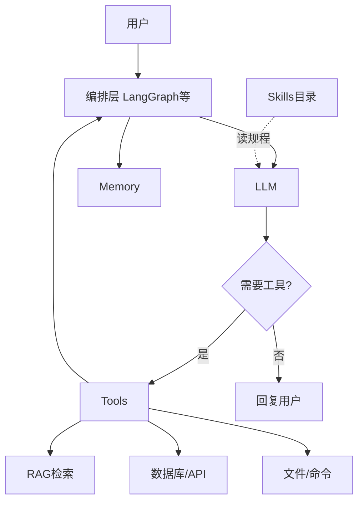
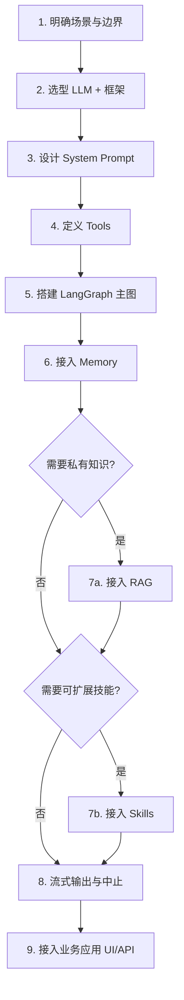
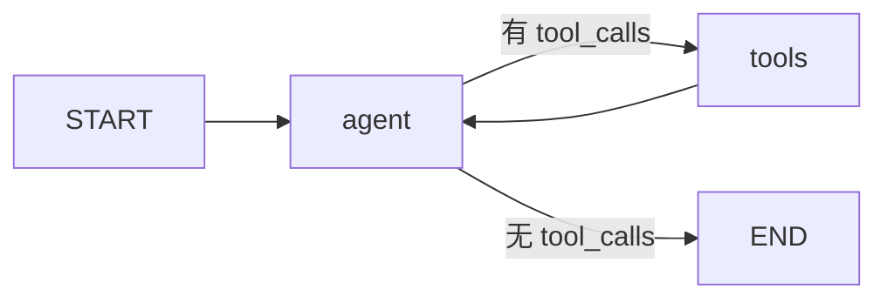
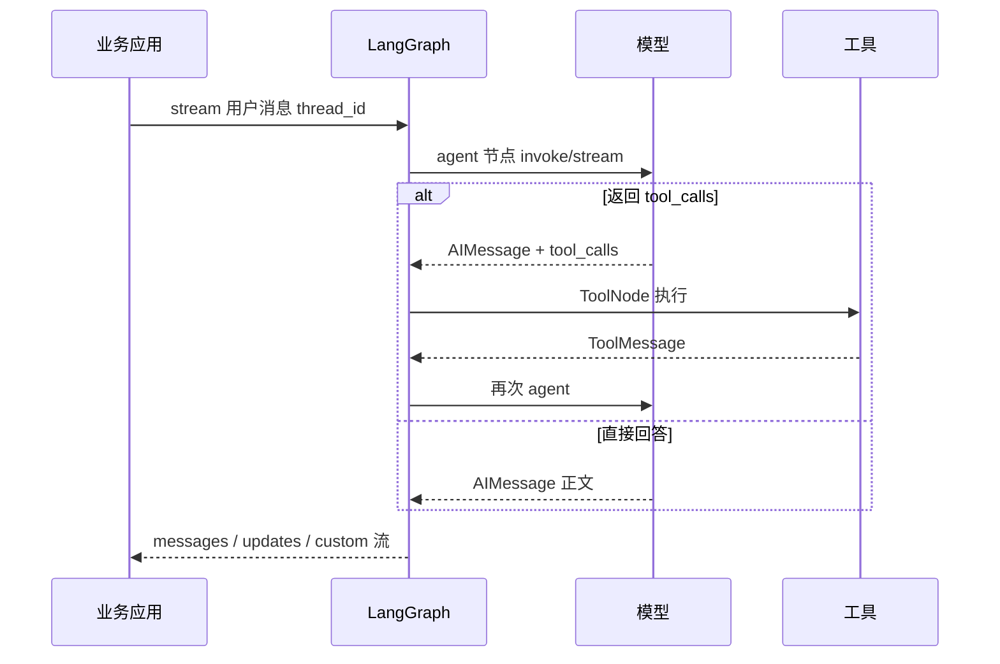
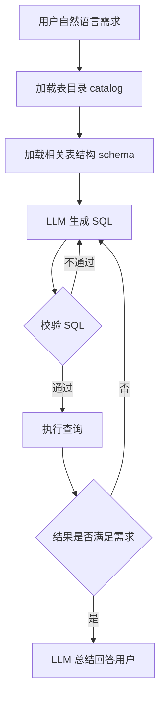
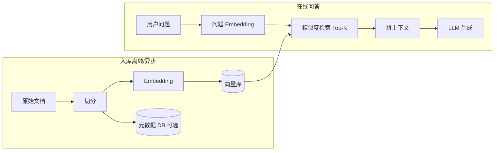
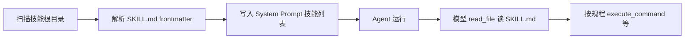

# Agent 架构技术分享

## 1. 到底什么是 Agent，由什么组成

### 1.1 定义

**Agent（智能体）** 是在大语言模型（LLM）之上，具备**自主决策与行动能力**的程序。与「单次问答」不同，Agent 运行在**多轮循环**中：

```
感知（用户输入 + 上下文）
  → 规划（LLM：是否调工具、调哪个、参数是什么）
  → 行动（执行工具）
  → 观察（工具结果写回对话）
  → 重复，直到给出最终答案或达到步数上限
```

常见范式：

| 范式 | 特点 | 适用场景 |
|------|------|----------|
| **ReAct** | 边推理边行动，工具结果即时反馈 | 通用助手、查库、检索 |
| **Plan-and-Execute** | 先拆步骤再逐步执行 | 长任务、流程固定的工作流 |
| **Reflection** | 执行后自我批评、修正 | 代码生成、写作润色 |

### 1.2 核心组件

| 组件 | 作用 | 制作时需回答的问题 |
|------|------|-------------------|
| **LLM** | 推理、生成、决定是否调用工具 | 用哪家模型？是否需要工具调用能力？ |
| **System Prompt** | 角色、边界、工具使用策略 | 什么能做、什么不能做、工具优先级？ |
| **Tools** | 连接外部世界（API、数据库、文件、搜索） | 需要哪些能力？入参/出参如何设计？ |
| **Memory** | 跨轮次保留上下文 | 仅本轮？多轮对话？跨会话？ |
| **Orchestrator** | 编排循环（图、状态机、while） | ReAct 环还是多节点工作流？ |
| **RAG**（可选） | 私有知识检索增强 | 文档从哪来？如何切分与检索？ |
| **Skills**（可选） | 可发现、可加载的领域能力包 | 规程放文档还是硬编码工具？ |

### 1.3 组件如何协同



一套完整 Agent = **编排层把 LLM、工具、记忆串成闭环**；RAG 与 Skills 是按需叠加的增强层，不是必需品。

---

## 2. 制作 Agent 需要用到哪些框架：Top 5 横向对比

选型取决于：编排复杂度、是否要 RAG/多 Agent、语言栈、是否自建 UI。

| 维度 | LangChain + LangGraph | LlamaIndex | AutoGen | CrewAI | Semantic Kernel |
|------|----------------------|------------|---------|--------|-----------------|
| **定位** | 通用 Agent + 显式图编排 | 数据索引与 RAG 优先 | 多 Agent 对话协作 | 角色分工任务链 | 企业级插件与规划器 |
| **编排** | `StateGraph`、条件边、子图 | Workflow / Query Engine | 群聊、Handoff | Crew → Task 流水线 | Planner + Plugins |
| **工具** | `tool()` + `ToolNode`，生态全 | 检索器 + 工具包装 | 代码执行、MCP | 内置角色工具 | 多语言 Plugin |
| **记忆** | Checkpointer（内存/Sqlite/Postgres） | 索引 + Chat Memory | 会话级状态 | 任务上下文 | 向量 + 会话存储 |
| **RAG** | 需自行组装（灵活） | **内置强项** | 需外接 | 需外接 | 需外接 |
| **多 Agent** | 子图、并行节点 | 有限 | **强项** | **强项** | 支持 |
| **学习曲线** | 中（需理解图与状态） | 中 | 中高 | 低（叙事直观） | 中（.NET 生态为主） |

**应用层补充**（不负责图编排，偏集成）：

- **Vercel AI SDK**：Web 流式 UI + 工具调用
- **Cursor Agent SDK**：CI/CD、云端自动化 Agent

**实践建议**：以 **LangChain 定义工具与消息、LangGraph 定义编排** 为主流组合；RAG 重度场景可借鉴 LlamaIndex 的索引策略；多角色协作再考虑 AutoGen / CrewAI。

---

## 3. 使用 LangChain 和 LangGraph 制作 Agent

本章描述**通用制作流程**，不绑定某一应用形态（Web、桌面、后端服务均可套用）。

### 3.1 Agent 制作流程总览



| 步骤 | 产出物 | 要点 |
|------|--------|------|
| 1. 场景 | 能力清单、禁止项 | 例如：只读数据库、必须引用检索片段 |
| 2. 选型 | 模型 + LangGraph | 确认模型支持 **function calling / tool use** |
| 3. Prompt | System 模板 | 写清工具优先级、输出格式、错误处理 |
| 4. Tools | Zod schema + 实现 | 每个工具：描述准确、返回结构化 JSON |
| 5. 主图 | ReAct 或自定义图 | 最小可行：`agent` ↔ `tools` |
| 6. Memory | Checkpointer + thread_id | 短期用 MemorySaver，生产换持久化 |
| 7. 增强 | RAG / Skills | 见第 6、7 章 |
| 8. 运行时 | stream + abort | `streamMode`、步数上限 `recursionLimit` |
| 9. 集成 | HTTP / IPC / WebSocket | Agent 核心与 UI 解耦 |

### 3.2 LangChain 负责什么

LangChain（JS/TS）在 Agent 中主要提供：

- **消息类型**：`HumanMessage`、`AIMessage`、`ToolMessage`、`SystemMessage`
- **模型封装**：如 `ChatOpenAI`，统一 `invoke` / `stream`、`bindTools`
- **工具定义**：`tool(fn, { name, description, schema })`，schema 常用 Zod
- **（可选）高层 API**：`createAgent` 快速搭 ReAct，适合原型；复杂编排仍推荐 LangGraph

### 3.3 LangGraph 负责什么

LangGraph 负责**显式编排**：节点、边、条件分支、持久化状态。

标准 **ReAct 主图**（绝大多数 Agent 的起点）：



对应代码骨架：

```typescript
import { StateGraph, StateSchema, MessagesValue, START, END } from '@langchain/langgraph';
import { ToolNode } from '@langchain/langgraph/prebuilt';
import { MemorySaver } from '@langchain/langgraph-checkpoint';

const State = new StateSchema({ messages: MessagesValue });

const graph = new StateGraph(State)
  .addNode('agent', callModel)      // LLM + bindTools
  .addNode('tools', new ToolNode(tools))
  .addEdge(START, 'agent')
  .addConditionalEdges('agent', routeAfterAgent, ['tools', END])
  .addEdge('tools', 'agent');

export const app = graph.compile({ checkpointer: new MemorySaver() });
```

**路由函数**逻辑：若最后一条 `AIMessage` 的 `tool_calls` 非空 → 进入 `tools`，否则 `END`。

### 3.4 从黑盒 `createAgent` 到显式图

| 方式 | 优点 | 缺点 |
|------|------|------|
| `createAgent`（LangChain） | 上手快，代码少 | 流程不透明，难插自定义节点 |
| `StateGraph`（LangGraph） | 节点可见、可测、可扩展 | 需理解状态与 checkpointer |

**迁移动机**（常见）：需要自定义进度推送、子流水线（如 SQL 多步）、条件分支、或规避某模型流式 tool_call 不稳定——就应切换到显式图。

### 3.5 运行时一次请求的链路



业务层只需：**传入消息、指定 `thread_id`、消费流式 chunk**；不必关心图内部循环细节。

---

## 4. LangGraph 深入讲解

> 依据 [LangGraph JS 官方文档](https://docs.langchain.com/oss/javascript/langgraph/graph-api)（Graph API、Persistence、Use Graph API）整理。包名：`@langchain/langgraph`，安装：`npm install @langchain/langgraph @langchain/core`。

LangGraph 把 Agent 工作流建模为 **图**：**State（状态）** + **Nodes（节点）** + **Edges（边）**。节点做完事，边决定下一步；状态在 super-step 之间通过 **reducer** 合并更新。

### 4.1 核心概念：State / Node / Edge

| 概念 | 说明 |
|------|------|
| **State** | 图的全局快照；用 `StateSchema` 定义字段与 reducer |
| **Node** | `(state, config) => Partial<State>`，可 sync/async |
| **Edge** | 普通边（固定下一跳）、条件边（路由函数）、入口边（从 `START`） |
| **Super-step** | 图的一次「节拍」；同一步内可并行执行多个节点 |
| **Compile** | **必须先 `compile()` 才能 `invoke`/`stream`**，并可挂载 checkpointer |

**推荐状态定义（当前官方主推 `StateSchema`）**：

```typescript
import { StateSchema, MessagesValue, ReducedValue, UntrackedValue } from '@langchain/langgraph';
import { z } from 'zod';

const AgentState = new StateSchema({
  messages: MessagesValue,           // 对话列表，内置 message reducer
  step: z.string().default('init'),  // 普通字段：后写覆盖
  logs: new ReducedValue(            // 并行节点结果合并
    z.array(z.string()).default(() => []),
    { reducer: (cur, n) => [...cur, n] }
  ),
  cache: new UntrackedValue(z.record(z.string(), z.unknown())), // 不写入 checkpoint
});

type State = typeof AgentState.State;
type Update = typeof AgentState.Update;
```

| 状态类型 | 行为 |
|----------|------|
| Zod 字段 | 默认 **last-value**，新值覆盖旧值 |
| `MessagesValue` | 消息追加/按 id 更新，支持 `HumanMessage` 或 `{ role, content }` |
| `ReducedValue` | 自定义 reducer，适合并行分支汇总 |
| `UntrackedValue` | 运行时有值，**checkpoint 不保存**（连接、临时缓存） |

旧写法 `Annotation.Root({ ... })` 仍可用，文档推荐迁移到 `StateSchema`。

---

### 4.2 Graph 构建 API（`StateGraph`）

| API | 说明 |
|-----|------|
| `new StateGraph(stateSchema)` | 创建图；可 `{ state, input, output }` 约束对外入出参 |
| `.addNode(name, fn, options?)` | 注册节点；`options.ends` 供 `Command` 动态路由声明目标 |
| `.addNode(fn)` | 省略 name 时用函数名作节点名 |
| `.addEdge(from, to)` | 固定边；`from` 可为 `START`，`to` 可为 `END` |
| `.addConditionalEdges(source, router, pathMap?)` | 条件边；router 返回节点名、`END`、或 `Send[]` |
| `.addConditionalEdges(START, router)` | **条件入口** |
| `.addSequence([n1, n2, ...])` | 顺序串联多节点 |
| `.compile(options)` | 得到可运行图；`options.checkpointer`、`cache`、`interruptBefore/After` |

**特殊节点**：

| 常量 | 含义 |
|------|------|
| `START` | 虚拟入口，用户输入从这里进入图 |
| `END` | 虚拟终止，图结束 |

**ReAct 最小图示例**：

```typescript
import { StateGraph, StateSchema, MessagesValue, START, END } from '@langchain/langgraph';
import { ToolNode } from '@langchain/langgraph/prebuilt';

const State = new StateSchema({ messages: MessagesValue });

const graph = new StateGraph(State)
  .addNode('agent', callModel)
  .addNode('tools', new ToolNode(tools))
  .addEdge(START, 'agent')
  .addConditionalEdges('agent', (s) => {
    const last = s.messages.at(-1);
    const calls = last?.tool_calls;
    return calls?.length ? 'tools' : END;
  })
  .addEdge('tools', 'agent')
  .compile({ checkpointer: new MemorySaver() });
```

**路由注意**：同一节点上 **不要混用** 静态 `addEdge` 与 `Command` 动态跳转，否则可能两条边都执行。

---

### 4.3 运行时 API（编译后的图）

| API | 说明 |
|-----|------|
| `graph.invoke(input, config?)` | 跑完一整轮，返回最终 state |
| `graph.stream(input, config?)` | 异步迭代流式事件 |
| `graph.getState(config)` | 读当前线程最新 `StateSnapshot` |
| `graph.getStateHistory(config)` | 按时间倒序列出 checkpoint 历史（time travel） |
| `graph.updateState(config, values, asNode?)` | 人工写入状态（注入历史、fork 分支） |
| `graph.batch(inputs[], config?)` | 批量调用 |

**`config` 常用字段**（`RunnableConfig`）：

| 字段 | 说明 |
|------|------|
| `configurable.thread_id` | **必填**（使用 checkpointer 时）；会话/线程隔离 |
| `configurable.checkpoint_id` | 从指定 checkpoint 恢复或读取 |
| `configurable.checkpoint_ns` | 子图 namespace（嵌套图） |
| `recursionLimit` | 最大 super-step 数，防 ReAct 死循环 |
| `signal` | `AbortSignal`，支持取消 |
| `tags` / `metadata` | 追踪与 LangSmith 集成 |

**`StateSnapshot` 主要字段**：`values`（状态值）、`next`（待执行节点）、`config`、`metadata`（含 `step`、`writes`）、`tasks`（含 `interrupts`）。

---

### 4.4 流式 API（`stream` / `streamMode`）

| `streamMode` | 输出内容 |
|--------------|----------|
| `values` | 每个 super-step 后的**完整 state** |
| `updates` | 每个 super-step 的**增量更新**（按节点名分组） |
| `messages` | LLM **token 级**消息流（需配合 `messages-tuple` 等） |
| `custom` | 节点/工具内 `config.writer` 或 `runtime.writer` 的自定义数据 |
| `debug` | 更细粒度调试信息 |

可传数组组合：`streamMode: ['updates', 'messages', 'custom']`。

```typescript
for await (const chunk of await graph.stream(
  { messages: [new HumanMessage('你好')] },
  { configurable: { thread_id: '1' }, streamMode: 'updates' }
)) {
  console.log(chunk);
}
```

---

### 4.5 控制流进阶 API

| API | 用途 |
|-----|------|
| **`Command`** | 节点返回：`update`（写状态）+ `goto`（下一节点）+ `graph`（`Command.PARENT` 跳父图） |
| **`Send`** | Map-Reduce：条件边返回 `Send('node', partialState)[]`，动态扇出 |
| **`interrupt()`** | 人机协同：暂停图，等待 `invoke(new Command({ resume: value }))` |
| **子图** | 节点内 `compile` 另一张图；checkpoint 有 `checkpoint_ns` |
| **节点缓存** | `addNode(name, fn, { cachePolicy: { ttl: 60 } })` + `compile({ cache })` |

`Command` 示例（状态更新 + 跳转合一）：

```typescript
import { Command, END } from '@langchain/langgraph';

const router = (state): Command => {
  if (state.done) return new Command({ goto: END });
  return new Command({ update: { count: state.count + 1 }, goto: 'process' });
};

builder.addNode('router', router, { ends: ['process', END] });
```

`interrupt` 恢复：

```typescript
import { Command, interrupt } from '@langchain/langgraph';

const review = async () => {
  const answer = interrupt('请审批');
  return { approved: answer };
};

await graph.invoke(input, config);                              // 首次，在 interrupt 处暂停
await graph.invoke(new Command({ resume: 'yes' }), config);   // 传入 resume 继续
```

---

### 4.6 持久化与记忆 API（Checkpointer）

官方包：`@langchain/langgraph-checkpoint`（及 `-sqlite`、`-postgres` 等）。

| Checkpointer | 场景 |
|--------------|------|
| `MemorySaver` | 开发/测试，进程重启丢失 |
| `SqliteSaver` | 本地持久化 |
| `PostgresSaver` | 生产多实例 |

**启用方式**：`graph.compile({ checkpointer })`，调用时带 `thread_id`。

| 能力 | 依赖 |
|------|------|
| 多轮对话记忆 | checkpointer + 同一 `thread_id` |
| Human-in-the-loop | checkpointer + `interrupt` |
| Time travel 调试 | `getStateHistory` + 指定 `checkpoint_id` 再 `invoke` |
| 故障恢复 | super-step 内已完成节点的 pending writes |

**短期 vs 长期**：

- **短期**：LangGraph 线程内 `messages` 由 checkpointer 自动维护。
- **长期**：应用层 DB 存历史 → 新会话/重启后用 `updateState` 灌回；或直接用 Postgres checkpointer。

```typescript
import { MemorySaver } from '@langchain/langgraph-checkpoint';

const checkpointer = new MemorySaver();
const app = workflow.compile({ checkpointer });

await app.updateState(
  { configurable: { thread_id: 'user-1' } },
  { messages: priorMessages },
  'agent'
);
```

---

### 4.7 模型与工具（与 LangChain 衔接）

LangGraph **不绑定**某一家模型；节点内通常用 LangChain `ChatModel`。

| 能力 | LangChain API |
|------|----------------|
| 绑定工具 | `model.bindTools(tools)` |
| 调用 | `invoke(messages)` / `stream(messages)` |
| 消息类型 | `SystemMessage`、`HumanMessage`、`AIMessage`、`ToolMessage` |

**预构建 `@langchain/langgraph/prebuilt`**：

| 组件 | 说明 |
|------|------|
| `ToolNode` | 根据 `tool_calls` 执行工具并生成 `ToolMessage` |
| `createReactAgent` | 一行生成 ReAct 图（原型用；复杂流程仍建议手写 `StateGraph`） |

工具定义（LangChain `tool()`）：

```typescript
import { tool } from 'langchain';
import { ToolMessage } from '@langchain/core/messages';

const search = tool(
  async (input, runtime) => {
    const hits = await searchApi(input.query);
    return new ToolMessage({
      content: JSON.stringify(hits),
      tool_call_id: runtime.toolCallId,
      name: 'search',
    });
  },
  { name: 'search', description: '…', schema: z.object({ query: z.string() }) }
);
```

长任务进度：工具内 `runtime.writer?.(...)`，图侧 `streamMode: 'custom'` 消费。

---

### 4.8 官方文档索引

| 主题 | 链接 |
|------|------|
| Graph API 总览 | https://docs.langchain.com/oss/javascript/langgraph/graph-api |
| 使用 Graph API（序列/分支/循环/Send/Command） | https://docs.langchain.com/oss/javascript/langgraph/use-graph-api |
| Persistence / Memory | https://docs.langchain.com/oss/javascript/langgraph/persistence |
| Streaming | https://docs.langchain.com/oss/javascript/langgraph/streaming |
| Interrupts（人机协同） | https://docs.langchain.com/oss/javascript/langgraph/interrupts |
| Subgraphs | https://docs.langchain.com/oss/javascript/langgraph/use-subgraphs |
| JS API Reference | https://langchain-ai.github.io/langgraphjs/reference/ |

---

## 5. SQL Agent：一种典型的领域 Agent

自然语言查库是 Agent 的**经典垂直场景**：用户说人话，系统生成并执行 SQL，再以自然语言回答。本节独立于具体项目，讲**通用架构与实现路径**。

### 5.1 为什么需要 SQL Agent，而不是让模型直接写 SQL

| 风险 | 对策 |
|------|------|
| 幻觉表名/字段 | 先拉 **schema**（目录 + 表结构）再生成 |
| 危险语句（DROP/DELETE） | **校验层** + 只读账号 + 白名单 |
| 结果过大撑爆上下文 | **分页/采样**，只把摘要给模型 |
| 答非所问 | **结果评估**环节对照用户意图 |

核心原则：**LLM 负责理解与生成，执行层负责约束与安全**。

### 5.2 两种 LangGraph 集成方式

| 方式 | 结构 | 优点 | 缺点 |
|------|------|------|------|
| **多工具 ReAct** | `get_schema` → `generate_sql` → `validate_sql` → `run_sql` 各为一个 tool | 模型可见每步、易调试单步 | 占多轮 ReAct 步数，易中途跑偏 |
| **单工具流水线** | 一个 `query_database`，内部固定 while 循环 | 主图简洁、步骤可控 | 工具内逻辑较重 |
| **LangGraph 子图** | 将上述流水线做成 subgraph 节点 | 可 time travel、可 interrupt 审批 | 实现成本高，适合多分支/多库 |

简单线性 + 有限重试：**单工具或子图二选一**即可；需要「人工审批 SQL」时用 **`interrupt()`** 插在 validate 之后。

### 5.3 推荐流水线



| 步骤 | 输入 | 输出 |
|------|------|------|
| 加载目录 | 可选库名 | 库/表/表注释列表 |
| 加载结构 | 候选表名 | 字段名、类型、约束 |
| 生成 SQL | 需求 + schema + 上轮错误 feedback | SELECT 语句 |
| 校验 | SQL + schema | `{ valid, reason, suggestion }` |
| 执行 | SQL | 行数、样本行、聚合结果 |
| 评估 | 需求 + 查询结果 | 是否 satisfied，否则 feedback |

重试策略建议：**校验重试 ≤ 2 次**，**生成-执行-评估大循环 ≤ 2 轮**，避免 token 与耗时失控。

### 5.4 与主 Agent 的协作方式

1. **System Prompt**：明确「凡统计/明细/报表类问题必须走 SQL 工具」，禁止编造数字。
2. **工具入参**：`requirement`（自然语言意图）+ 可选 `tables` / `database`。
3. **工具返回**：`{ ok, summary, data }`；Prompt 要求模型只输出 **summary 级结论**，勿贴原始大表。
4. **Schema 缓存**：目录可启动时预热进 Prompt，减少每次查 catalog 的延迟。

### 5.5 安全清单

- 数据库账号 **只读**；禁止多语句；拦截 `INSERT/UPDATE/DELETE/DDL`。
- SQL 解析或 AST 白名单（仅 `SELECT`）。
- 执行超时、最大返回行数；超阈值只返回 count + 前 N 行样本。
- 敏感列脱敏；审计日志记录最终执行的 SQL。

### 5.6 何时用 LangGraph 子图做 SQL

适合子图的场景：

- 多数据源并行探查（`Send` 扇出）
- SQL 执行前 **interrupt** 人工确认
- 查询结果不满意时，在图级做分支（改表 / 改口径 / 结束）

不必上子图的场景：

- 单库、线性步骤、固定重试 —— **工具内循环**或 **普通节点函数** 即可。

---

## 6. RAG 如何实现

RAG（Retrieval-Augmented Generation）= **先检索相关片段，再让 LLM 基于片段回答**，解决模型不知道私有文档的问题。

### 6.1 标准链路



### 6.2 入库（Ingest）

| 步骤 | 说明 |
|------|------|
| 读取 | 支持 txt/md/pdf 等，注意编码与解析 |
| 切分 | 按段落或固定长度；**overlap** 避免语义断在边界 |
| 可选摘要 | 分段摘要 + 合并，便于目录展示，不能替代全文检索 |
| Embedding | 选定向量模型，**维度与库表一致** |
| 写入 | 向量库存 chunk；元数据库存标题、路径、chunk 数 |

**顺序建议**：先写向量，再写元数据——避免向量失败却留下「空文档」记录。

### 6.3 检索（Retrieve）

1. 用户问题 → embedding。
2. 向量库 **Top-K** + **相似度阈值**（如余弦：`1 - distance`）。
3. 命中 chunk 拼入工具返回或 Prompt；**截断单段长度**，控制 token。

暴露给 Agent 的方式：**检索工具**（如 `search_documents`），由模型决定何时查，而不是每次全量塞上下文。

### 6.4 与 Agent 的配合

| 策略 | 做法 |
|------|------|
| Prompt 只放目录 | System 里列文档标题/摘要，正文**必须**调检索工具 |
| 工具返回 | `{ hits: [{ text, similarity, source }] }` |
| 防幻觉 | Prompt 要求「无检索命中则说明不知道」 |

技术选型示例：PostgreSQL **pgvector**、Pinecone、Milvus、Chroma；Embedding 可用 OpenAI、智谱、本地模型等，关键是**入库与查询同一模型**。

---

## 7. 如何接入 Skills

Skills 是一种**可扩展、可发现的能力包**：每个技能 = 目录 + 说明文档（如 `SKILL.md`），而非把所有规程写死在代码里。

### 7.1 与 Tools 的区别

| | Tools | Skills |
|---|-------|--------|
| 定义时机 | 开发时注册进代码 | 运行时扫描目录 |
| 内容 | 可执行函数 | 文档规程 + 现有工具组合 |
| 扩展 | 改代码发版 | 新增文件夹即可 |

### 7.2 接入流程



1. **发现**：启动时递归扫描 `SKILL.md`，解析 `name`、`description`。
2. **注入**：将列表写入 System Prompt（名称 + 一句话描述 + 文档路径）。
3. **执行**：Prompt 规定——决定使用某技能后，**必须先读取 SKILL.md**（及引用文件），再按文档调用 `read_file`、`execute_command` 等已有工具。
4. **一般不设** `invoke_skill` 专用工具：技能本质是**规程**，执行仍走通用工具。

### 7.3 编写 SKILL.md 建议

```markdown
---
name: my-skill
description: 一句话说明何时使用
---

## 何时使用
...

## 步骤
1. ...
2. ...

## 命令示例
...
```

### 7.4 扩展新技能

1. 在技能根目录下新建文件夹，添加 `SKILL.md`。
2. 重启 Agent 或触发重新扫描。
3. 用对话测试：模型应**先读文档再行动**，而非凭技能名猜测。

---

## 制作检查清单（收尾用）

| 类别 | 检查项 |
|------|--------|
| 模型 | 支持 tool calling；温度与 max_tokens 合理 |
| Prompt | 工具优先级、输出语言、错误时如实告知 |
| 图 | `recursionLimit`、abort、流式模式齐全 |
| 工具 | schema 校验、结构化返回、长任务有进度 |
| 记忆 | 生产是否持久化；重启能否恢复会话 |
| RAG | 切分/维度/阈值；摘要与检索分工清晰 |
| Skills | 列表注入；规程可读；禁止未读文档就执行 |
| 安全 | API Key 不进前端；SQL/命令有白名单与限流 |

---

*本文以 LangChain + LangGraph 为主线，描述通用 Agent 制作流程；具体工程实现可选用 Electron、Web、纯后端等任意载体。*
